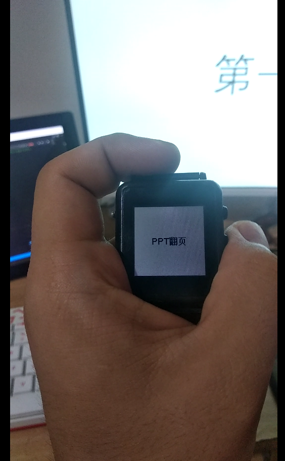
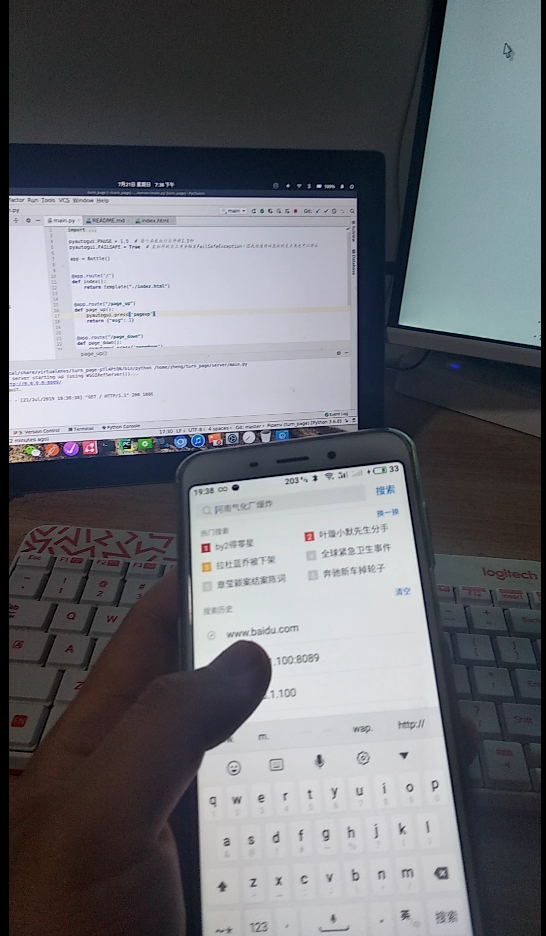

###　局域网内利用手机OR智能手表给电脑的ppt翻页(或其他控制)


**前提条件python基基基础**

#### 环境依赖

> * pyautogui
> * bottle 

安装命令
```shell
sudo apt-get install python3-tk python3-dev python3-pip # 安装pyautogui环境

pip3 install pyautogui　#　用于控制鼠标or键盘
pip3 install bottle　# 用于接收响应客户端的http请求
```

#### 文件夹说明

> * mb_turn_page 麦步手表客户端程序，可使用手表控制ppt翻页
> * server 服务器端程序,用于接受手表/手机端发送的指令，来执行对应的操作
> * VisualMWatch_W64 智能手表win64环境下的交叉编译器

#### 参考文档

> * bottle 官方文档(web框架)[http://www.bottlepy.org/docs/dev/](http://www.bottlepy.org/docs/dev/).
> * pyautogui 文档(控制鼠标和键盘,界面无关性)[https://pyautogui.readthedocs.io/en/latest/](https://pyautogui.readthedocs.io/en/latest/).
> * 麦步开发者平台 [http://dev.maibu.cc/sdk/watch](http://dev.maibu.cc/sdk/watch)

#### 演示视频

##### 手表端演示视频
[](./video/watch.mp4)

##### web端演示视频
[](./video/mobile.mp4)

#### bug说明

**如果不想让其他人操作你的ppt，请不要把你的ip透露给别人，因为其他人也可以控制你的ppt**
